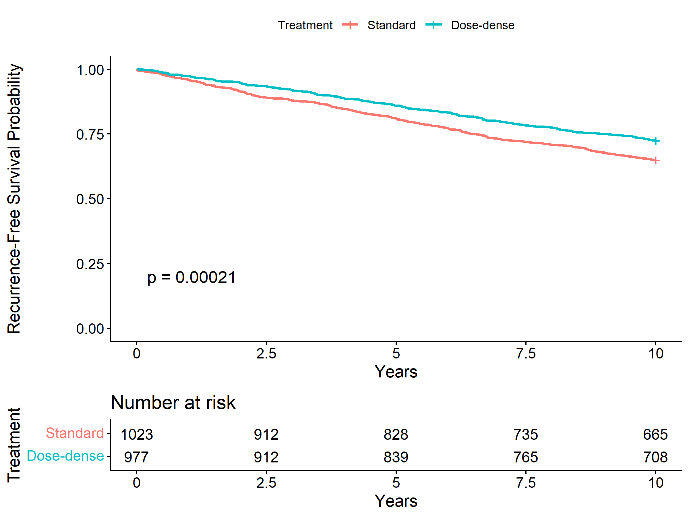
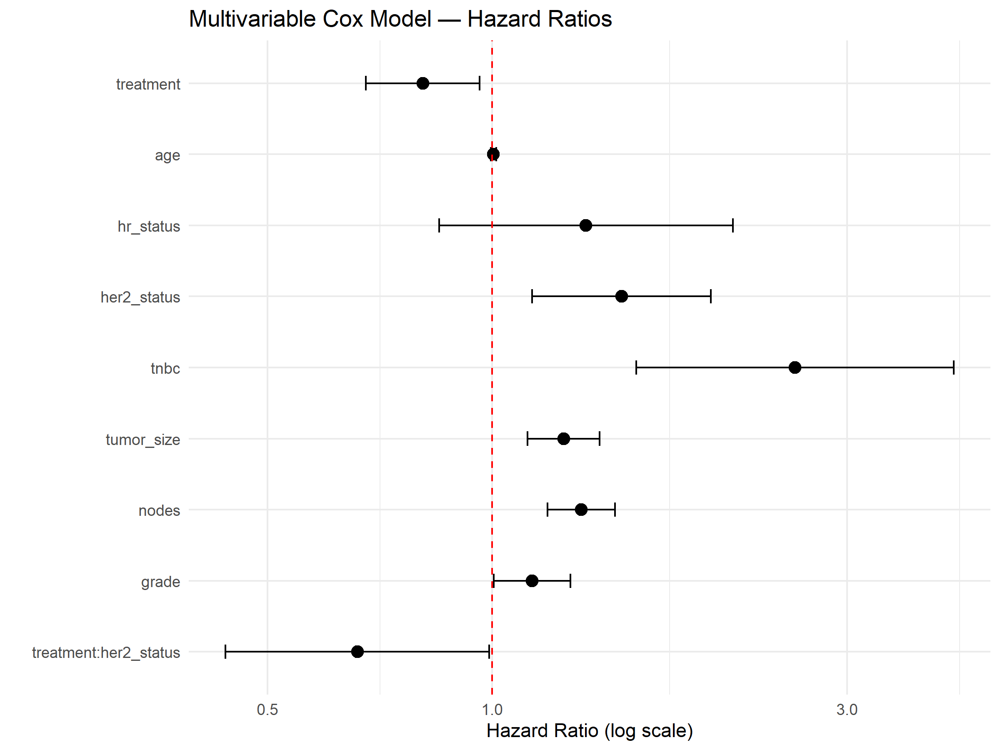
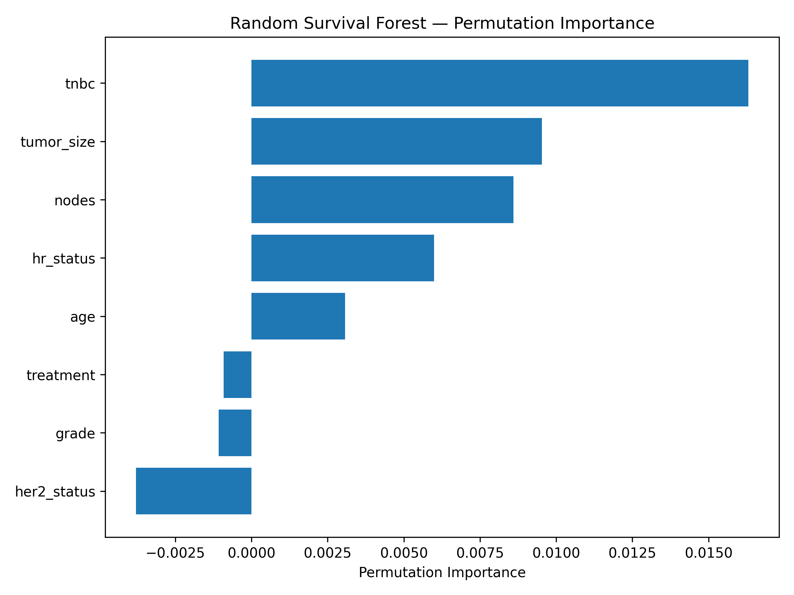
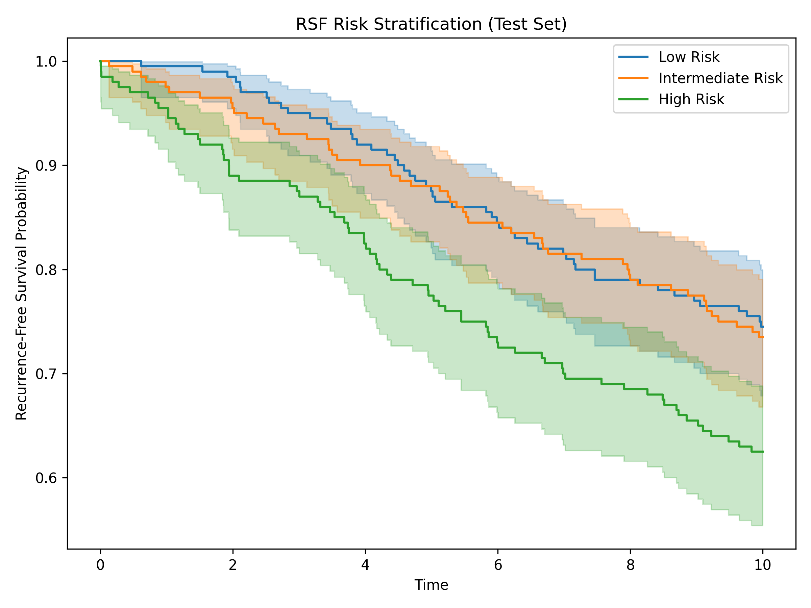
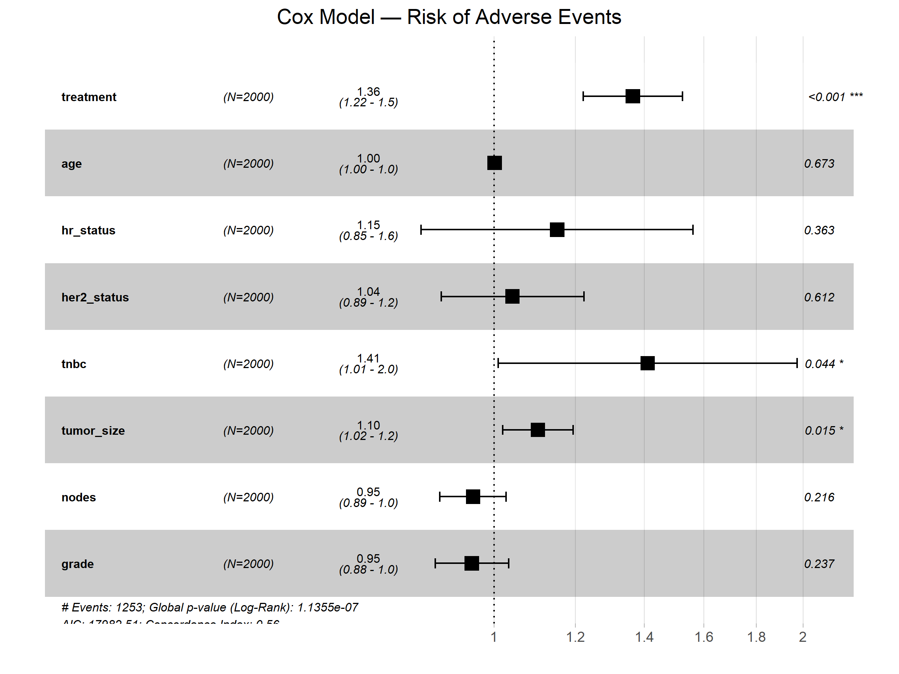
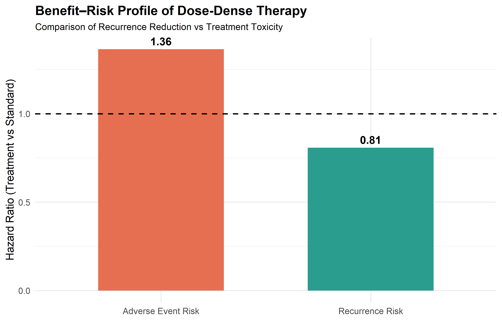

# Oncology Survival Modeling  
Hybrid Clinical Trial Analytics: Efficacy, Toxicity, and Benefit–Risk Evaluation

---

## Executive Summary

This project simulates a Phase III breast cancer clinical trial (n = 2000) and evaluates recurrence-free survival using both classical biostatistical methods and machine learning survival models.

The objective is to demonstrate an end-to-end hybrid clinical analytics workflow applicable to oncology trials, translational research, and regulatory survival modeling.

---

## Key Results

### Recurrence-Free Survival (Kaplan–Meier)

Dose-dense therapy demonstrates improved recurrence-free survival compared with standard treatment.

---

### Cox Proportional Hazards Model

Multivariable Cox regression confirms a treatment benefit while adjusting for clinical covariates.

---

### Random Survival Forest Feature Importance

Machine learning survival modeling identifies key predictors influencing recurrence risk.

---

### Risk Stratification (Random Survival Forest)

RSF-based stratification separates patients into clinically meaningful risk groups.

---

### Adverse Event Risk Modeling

Safety analysis demonstrates increased toxicity risk associated with dose-dense therapy.

---

### Benefit–Risk Profile

Combined efficacy and safety modeling illustrates the classical oncology trade-off between recurrence reduction and treatment toxicity.

---

## Study Design (Simulated)

- Sample size: 2000 patients  
- Endpoint: Recurrence-Free Survival (time-to-event)  
- Comparison: Standard vs Dose-Dense Treatment  
- Censoring: Administrative censoring applied  

### Clinical Covariates Modeled

- Treatment arm  
- Age  
- Hormone receptor (HR) status  
- HER2 status  
- Triple-negative status  
- Tumor size  
- Lymph node involvement  
- Tumor grade  

---

## Statistical Survival Modeling (R)

- Kaplan–Meier survival estimation  
- Log-rank test  
- Multivariable Cox Proportional Hazards model  
- Treatment × HER2 interaction analysis  
- Harrell’s Concordance Index  

### Performance

C-index (Cox Model): 0.615  

Interpretation: Moderate discrimination consistent with structured clinical covariate modeling.

---

## Machine Learning Survival Modeling (Python)

- Random Survival Forest  
- Out-of-bag concordance estimation  
- Permutation importance ranking  

### Performance

C-index (RSF): 0.585  

Interpretation: Comparable but slightly lower discrimination relative to classical Cox modeling in this structured dataset.

---

## Model Diagnostics

The proportional hazards assumption was assessed using Schoenfeld residuals.  
The global test was non-significant (p = 0.46).  
Time-varying coefficient modeling was explored but did not improve discrimination, supporting retention of the standard Cox model.

---

## Model Performance Comparison

| Model | C-index |
|-------|---------|
| Cox Proportional Hazards | 0.615 |
| Random Survival Forest | 0.585 |

---

## Key Findings

- Dose-dense treatment demonstrates survival benefit  
- HER2 status modifies treatment effect  
- Cox regression provides better discrimination than Random Survival Forest under proportional hazards assumptions  
- Interaction modeling enhances clinical interpretability  

---

## Methodological Strengths

- Integration of statistical and machine learning survival models  
- Explicit interaction modeling (Treatment × HER2)  
- Cross-platform validation (R and Python)  
- Discrimination assessment using C-index  
- Reproducible hybrid analytics workflow  

---

## Technical Stack

### R
- survival  
- survminer  

### Python
- scikit-survival  
- lifelines  
- pandas  
- numpy  

---

## Repository Structure

- breast_cancer_survival_modeling.R — Recurrence survival analysis using Cox regression

- python_survival_modeling.ipynb — Random Survival Forest survival modeling

- adverse_event_modeling.R — Time-to-adverse event safety analysis

- trial_data.csv — Simulated clinical trial dataset

- trial_data_with_ae.csv — Dataset augmented with simulated adverse event outcomes

---

## Practical Relevance

This workflow mirrors real-world analytics tasks in:

- Clinical trial data analysis  
- Oncology outcomes research  
- Pharma biostatistics support  
- Real-world evidence modeling  
- Regulatory survival analysis pipelines
  
---

### Clinical Context

Inspired by dose-dense chemotherapy trials such as:

Citron ML et al. (2003), The Lancet — CALGB 9741.

---

## Risk Stratification Analysis

Both Cox and Random Survival Forest models were used to stratify patients into tertile-based risk groups.

### Cox Risk Groups
Clear survival separation observed across low, intermediate, and high-risk categories.

### RSF Risk Groups (Test Set)
Despite slightly lower C-index, RSF demonstrated clinically meaningful separation between risk strata.

These findings support practical utility for treatment personalization and recurrence monitoring.

---

### Safety Modeling — Time-to-Adverse Event Analysis

To complement efficacy modeling, a safety analysis was conducted to evaluate treatment-related toxicity using time-to-adverse event survival modeling.

Adverse event (AE) times were simulated using a proportional hazards framework incorporating treatment intensity and tumor aggressiveness.

## AE Hazard Structure

The adverse event hazard incorporated the following modifiers:

Dose-dense therapy increases toxicity risk

Triple-negative breast cancer slightly increases AE susceptibility

Larger tumors modestly increase treatment-related toxicity

## Statistical Analysis

Adverse event outcomes were analyzed using:

Kaplan–Meier estimation of AE-free survival

Log-rank comparison by treatment arm

Multivariable Cox proportional hazards modeling

## Performance

C-index (AE Cox Model): ~0.56

Interpretation: Toxicity prediction typically demonstrates lower discrimination due to biological and treatment-related variability.

## Key Finding

Dose-dense therapy was associated with increased adverse event risk (HR > 1), consistent with intensified chemotherapy regimens.

---

### Benefit–Risk Evaluation

A benefit–risk comparison was conducted by jointly examining treatment effects on recurrence risk and adverse event risk.

Concept

Oncology treatment decisions require balancing:

- Efficacy benefit (reduction in recurrence risk)

- Safety burden (increase in treatment toxicity)

Using hazard ratios derived from Cox models, a benefit–risk visualization was constructed comparing:

- Recurrence risk (efficacy outcome)

- Adverse event risk (toxicity outcome)

## -Interpretation

Results demonstrate the classical oncology trade-off:

- Dose-dense therapy reduces recurrence risk

- Dose-dense therapy increases toxicity risk

This type of evaluation mirrors real-world analyses performed during:

- Phase III trial evaluation

- Regulatory review

- Clinical guideline development
